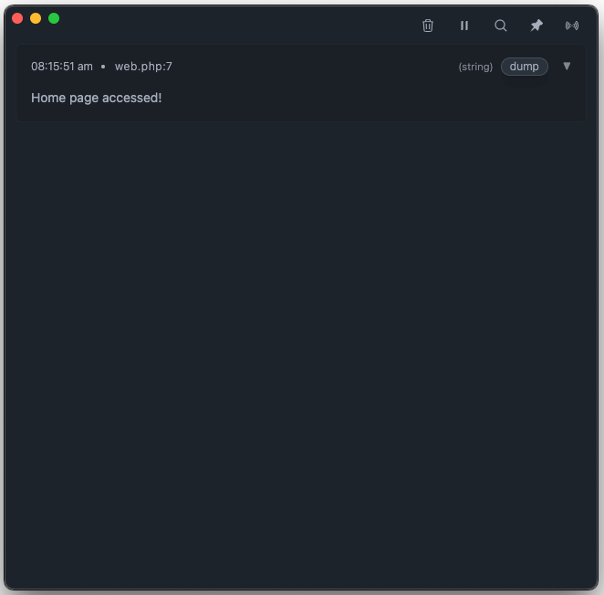

<p align="center">
  
</p>
<h1 align="center">LaraDumps</h1>
<div align="center">
  <h4><a href="https://laradumps.dev/get-started/installation.html" target="_blank">Download the App</a></h4>
  <sub>Available for Windows, Linux and macOS.</sub>
  <br />
  <br />
  <p>
    <a href="https://laradumps.dev"> 📚 Documentation </a>
  </p>
</div>
 <br/>
<div align="center">
  <p align="center">
    <a href="https://packagist.org/packages/laradumps/laradumps">
      
    </a>
    <a href="https://packagist.org/packages/laradumps/laradumps">
      
    </a>
    <a href="https://packagist.org/packages/laradumps/laradumps">
      
    </a>
    <a href="https://github.com/laradumps/laradumps/actions">
        
    </a>
    <a href="https://packagist.org/packages/laradumps/laradumps">
      
    </a>
  </p>
</div>

### 👋 Hello Dev,

<br/>

LaraDumps is a modern, feature-rich debugging tool that makes PHP development a breeze.

When using LaraDumps, the outcome of your debug dump is presented in a separate desktop application rather than in your browser or command-line interface, ensuring that your application flow remains uninterrupted.

### Key Features

LaraDumps goes beyond dumping variables. In addition to functions similar to `dump()` and `dd()`, LaraDumps provides tools for validating JSON, searching for substrings, clocking execution time, and a convenient way to view `phpinfo()` output.

Among other functionalities, you can debug Livewire/Volt components and inspect Eloquent Models, Collections, and Stringable classes. LaraDumps also integrates with Pest PHP, assisting you while writing tests.

The desktop application can monitor and display SQL queries and slow queries, logs, exceptions, mail, executed jobs, authorization gates, Artisan commands, scheduled commands, cache, and [much more...](https://laradumps.dev/debug/reference-sheet.html)

#### Example

Here's an example of LaraDumps `ds()` debug function in the project's home page route.

```php
Route::get('/', function () {
    ds('Home page accessed!');
    return view('home');
});
```

By opening this page in your browser, the desktop App will display the dump, and the page will be loaded without any interference.

<p align="center">
  
</p>

<br/>

### Get Started

#### Requirements

PHP 8.1+ and Laravel 10.0+.

For PHP projects that are not built on Laravel, please refer to the [laradumps/laradumps-core](https://github.com/laradumps/laradumps-core) repository.

#### Installation

Please take a moment to check our [installation page](https://laradumps.dev/get-started/installation.html) at our documentation website.

<br/>

### Credits

LaraDumps is a free open-source project, and it was inspired by [Spatie Ray](https://github.com/spatie/ray).

- Author: [Luan Freitas](https://github.com/luanfreitasdev)

- Logo by [Vitor S. Rodrigues](https://github.com/vs0uz4)

- Thanks to all [contributors](http://github.com/laradumps/laradumps/contributors)
